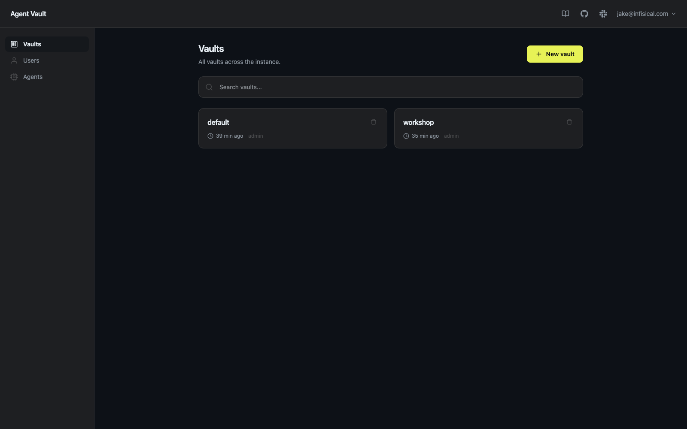

# Checkpoint 1: A broker on your machine

**Goal:** a running broker, an owner account, and a vault to work in. ~3 minutes.

> **Install first.** This repo's [README](../README.md) lists the prerequisites: the **Agent Vault CLI**,
> **Docker**, and (for the agent-driven steps) **Claude Code** / **Codex**.
> - Repo: `github.com/jakehulberg/credential-brokering-workshop`
> - Install the CLI: <https://docs.agent-vault.dev/installation>
>
> Get those working before you start the steps below.

> **Where you run things:** Checkpoints 1 and 2 all happen in **one normal terminal** on your own
> machine (the shell where `agent-vault` is installed), plus the **web UI** in your browser for the
> click-along bits. The broker you start in step 1 keeps running in the background, so you keep using
> the same terminal. Checkpoint 3 is the only one that adds a Docker container and a second terminal,
> and it'll tell you when.

> Most steps have a **UI** way and a **CLI** way. Do whichever you like; they're equivalent.

## 1. Start the broker  (CLI, the broker *is* the server)

```bash
agent-vault server -d
```

On first run Agent Vault prompts for a master password. **Press Enter to leave it empty (passwordless)**,
fine for a local workshop on your own machine. `-d` runs it in the background; drop `-d` to keep it in
the foreground. It listens on `http://localhost:14321` (web UI + API) with the transparent proxy on
`:14322`. (Stop it later with `agent-vault server stop`.)

## 2. Become the owner

The first account to register becomes the instance **owner** and gets admin on every vault it makes.

- **UI:** open `http://localhost:14321/register` and create your account.
- **CLI:** `agent-vault auth register --email you@workshop.test` (it prompts for a password).

## 3. Create your vault

A **vault** is the container for credentials, services, and the agents allowed to use them.

- **UI:** sidebar → **Vaults** → **New vault** → name it `workshop`.
- **CLI:** `agent-vault vault create workshop`



---

✅ **Checkpoint reached when:** the `workshop` vault shows in the UI (or `agent-vault vault list`),
and `http://localhost:14321` loads in your browser.

Next: [02-first-agent.md](02-first-agent.md).
