<!-- _class: cover -->
<!-- _paginate: false -->


# Credential brokering for AI agents

## Give an agent real powers, safely

Jake Hulberg · Infisical

<div class="cover-clone">

<span><strong>Clone along</strong><br/><code>github.com/jakehulberg/credential-brokering-workshop</code></span>
</div>

---

# How this runs

<div class="cols">
<div>
<strong>The shape</strong>
<ul>
<li>~25 min walkthrough</li>
<li>~50 min live demo + workshop</li>
<li>~15 min Q&A</li>
</ul>
</div>
<div>
<strong>Prereqs (to follow along)</strong>
<ul>
<li>Agent Vault CLI <code>get.agent-vault.dev</code></li>
<li>Docker</li>
<li>Claude Code or Codex (the agent steps)</li>
</ul>
<p>Full list in the repo README.</p>
</div>
</div>

---

# What we'll do

- See the problem (credential exfiltration)
- See the solution (credential brokering)
- Stand up a broker (Agent Vault)
- Lock it down (container egress isolation)
- Do it yourself with a local agent
- Go further: extensions, HA, multi-agent setups

---

<!-- _class: divider -->

# First, some words

---

# Terminology

- **Harness** vs **model** ("the brain")
- **Agent** = a model in a loop that can take actions
- **Tool use** = the agent calling out to do things
- **Secret / credential** = an API key, token, password

---

# What are you having your agents DO?

- Coding
- Pushing to GitHub
- Querying databases
- SSHing into boxes
- Sending email
- Everything

---

# Secrets management: the world before agents

- `.env` files in plaintext
- `.env` files accidentally committed to git
- Secret sprawl
- Rotation pain
- The fix: secrets managers (Infisical, Vault, AWS SM)

---

# How we hand agents access today

<div class="cols">
<div>
<ul>
<li><code>.env</code> file</li>
<li>env var injection</li>
<li>A sneaky agent can <code>echo $VAR</code>, bash it, print it</li>
</ul>
</div>
<div>
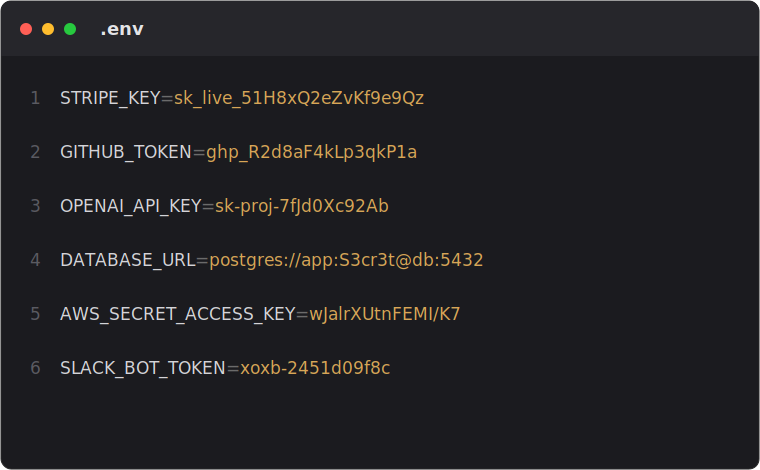
</div>
</div>

---

<!-- _class: problem -->

# AI agents can leak your credentials

- Your secrets manager protects the key at rest and in transit to the app
- Once the agent can read it, the manager's job is done, and the agent is the weak point
- The failure mode has a name: **credential exfiltration**

---

# Anatomy of an exfil


---

# Where does the prompt injection come from?

- A GitHub PR or issue the agent reads
- A file in the repo with a hidden prompt
- A poisoned skill or tool definition

---

# 1 in 3 skills carries prompt injection

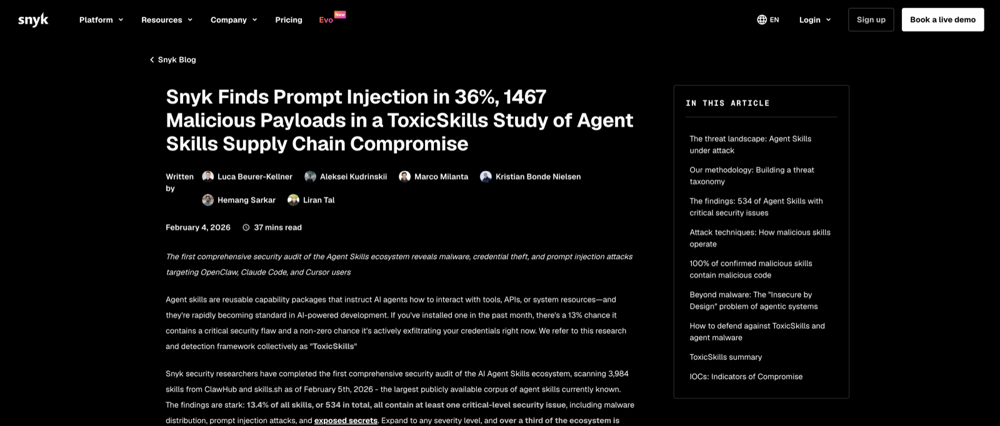

---

# Software is deterministic. Agents aren't.


---

# The dilemma

- We want agents to have access.
- We don't want to hand them the keys.

## Can we have both?

---

# The answer: credential brokering

A proxy between the agent and the API that
**holds the real credentials** and attaches them to outbound requests.

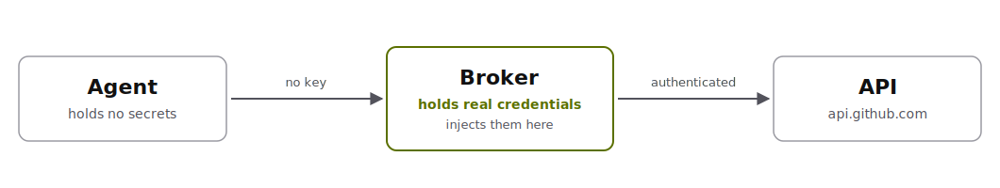

---

# Like mitmproxy, but for credentials

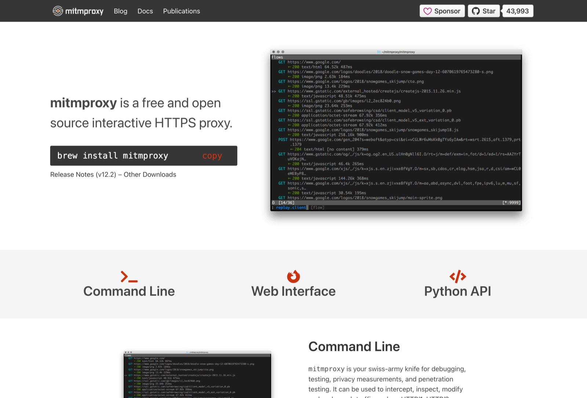

---

# Credential brokering in the wild

- Anthropic Managed Agents
- Vercel
- Cloudflare outbound Workers

---

# Anthropic: Managed Agents

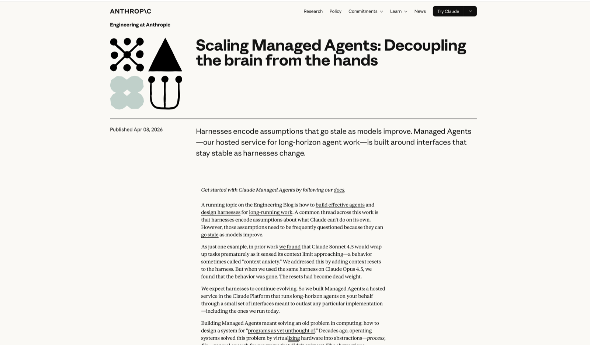

---

# In Anthropic's own words

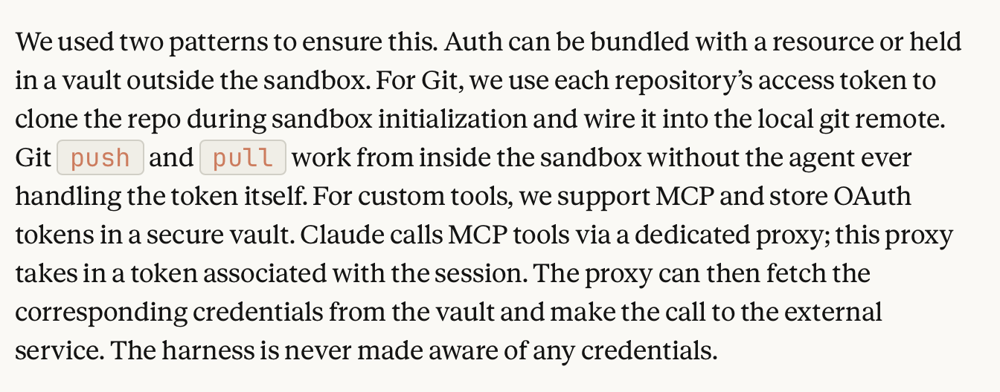

---

# Vercel: Sandbox header injection

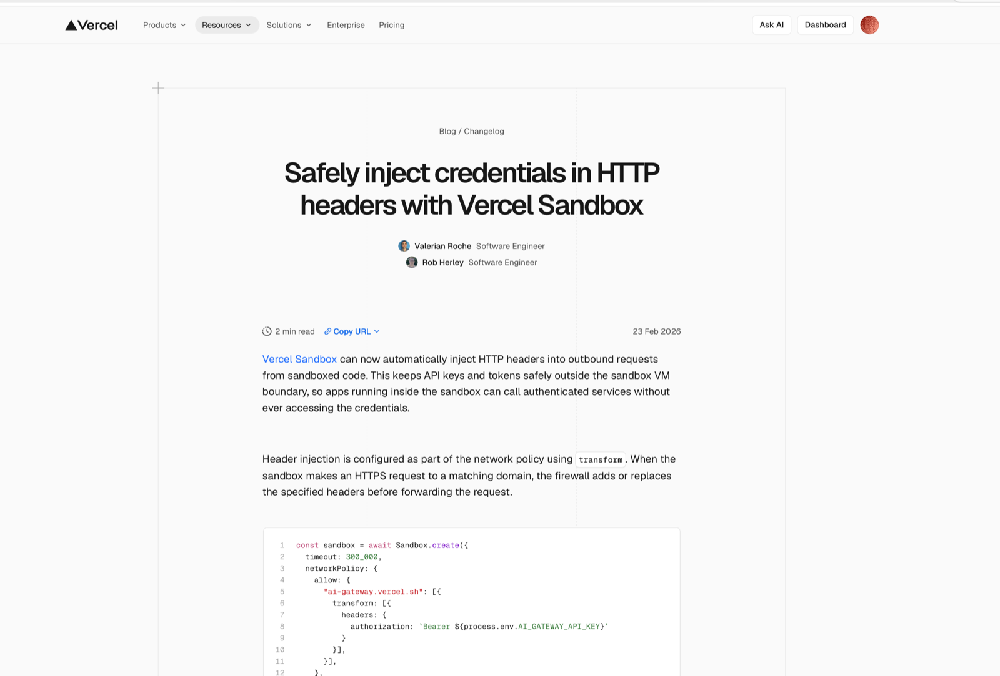

---

# Cloudflare: injection + egress

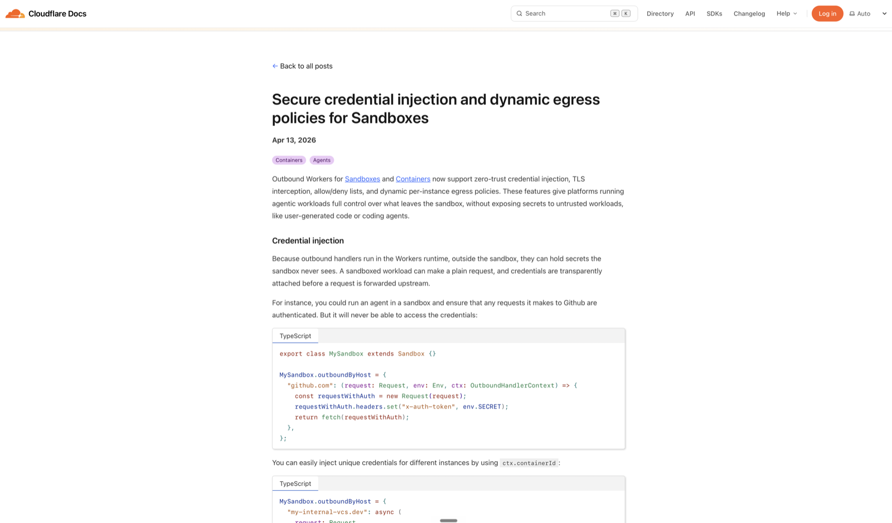

---

# Agent Vault

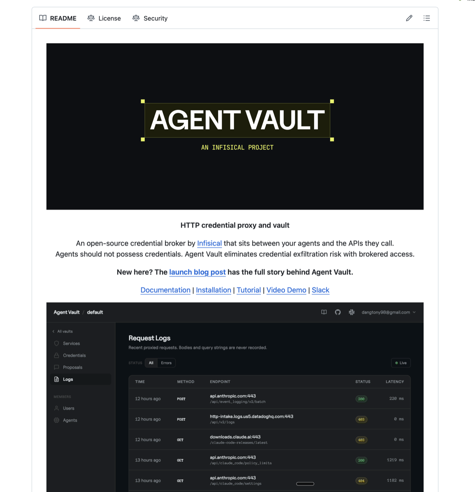

---

# The brokered architecture


---

# The agent never holds the secret.

- Interface-agnostic: SDK, CLI, MCP, raw calls all bottom out in HTTPS
- Broker at that layer and it works no matter how the agent talks to the API

---

# How it's organized


---

# How does the agent even know to use this?

- `agent-vault run` sets `HTTPS_PROXY` + CA trust, so its HTTP traffic routes through the broker **automatically**, no agent buy-in needed
- It also installs a **skill**: docs that teach the agent to **request access** (raise a proposal) when it's missing something

---

# Follow along

<div class="cols">
<div>
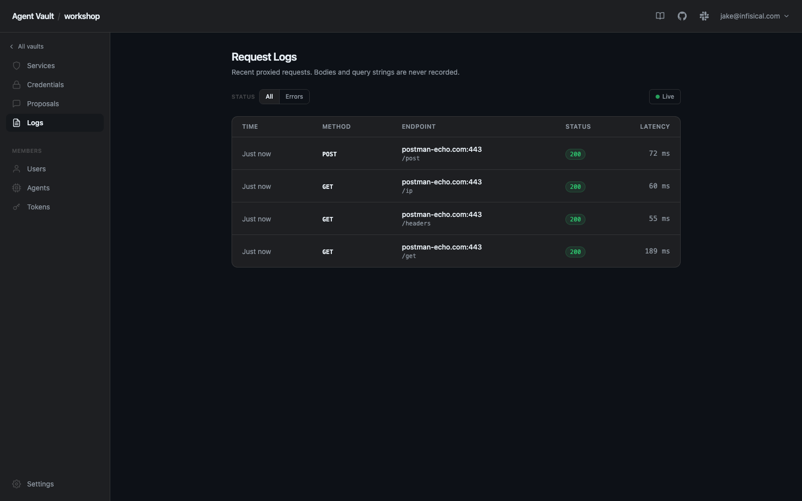
</div>
<div>
<strong>Clone today's repo</strong>
<p><code>github.com/jakehulberg/credential-brokering-workshop</code></p>

</div>
</div>

---

# Your turn: Checkpoint 1

<div class="cols cols-preview">
<div>
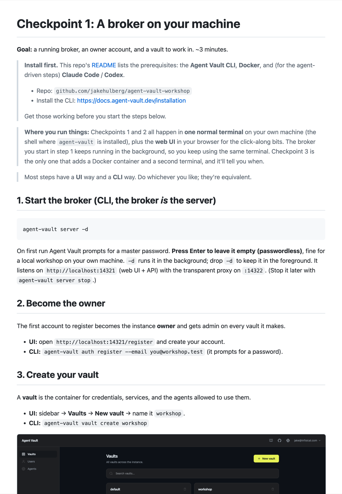
</div>
<div>
<strong>A broker on your machine</strong>
<p>Open <code>checkpoints/01-broker-up.md</code>: start the broker, register, create the <code>workshop</code> vault.</p>
<p>~3 min. Install links are at the top of the doc.</p>
</div>
</div>

---

# Your turn: Checkpoint 2

<div class="cols cols-preview">
<div>
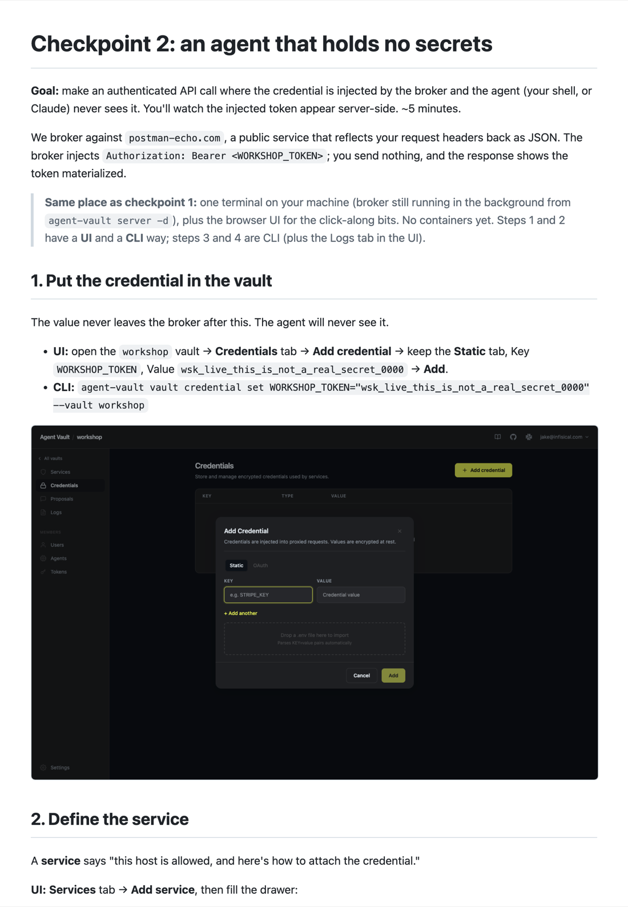
</div>
<div>
<strong>The agent that holds no secrets</strong>
<p>Open <code>checkpoints/02-first-agent.md</code> and follow along, UI or CLI.</p>
<p>The broker injects the credential. You send nothing.</p>
</div>
</div>

---

# How do I know the auth scheme?

<div class="cols">
<div>
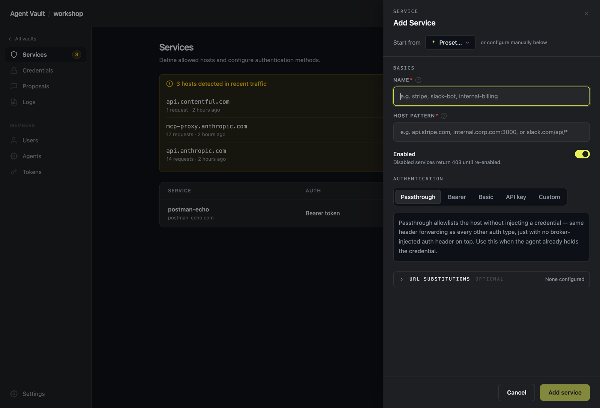
</div>
<div>
<ul>
<li><strong>Preset</strong>: 22 common APIs prefill the auth type + header</li>
<li><strong>Detected in recent traffic</strong>: broker reads the scheme, one click to add</li>
<li><strong>Passthrough</strong>: truly custom, the agent sends its own auth</li>
</ul>
</div>
</div>

---

# When the agent needs new access

It can't grant itself. It **requests**, you **approve**, it's **audited**.

---

# One request, end to end


---

# How it sees inside TLS


---

# Running it well


---

# One broker, every agent

Claude · Codex · gh / curl · Cursor · OpenClaw · custom

```bash
agent-vault run --vault workshop -- claude
agent-vault run --vault workshop -- curl -s https://postman-echo.com/get
agent-vault run --vault workshop -- codex
```

---

<!-- _class: lead -->

# A malicious agent could just... not use the proxy.

## So how do we make sure it can't?

---

<!-- _class: checkpoint -->

# Lock it at the kernel (Checkpoint 3)

<div class="cols cols-preview">
<div>
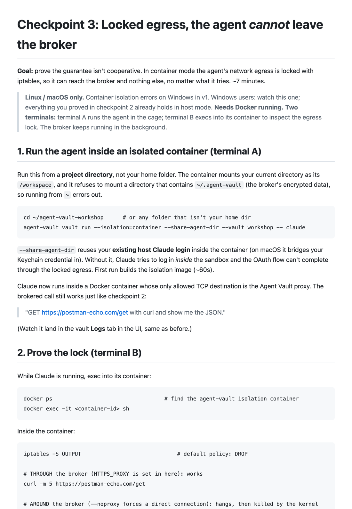
</div>
<div>
<strong>The agent <em>cannot</em> leave the broker</strong>
<p>Open <code>checkpoints/03-isolation.md</code> and follow along (Linux / macOS).</p>
<p>Container mode locks egress at the kernel: the broker is the only way out.</p>
</div>
</div>

---

# What this does and doesn't do

**Stops:**
- the agent holding or leaking secrets
- egress anywhere but the broker

**Doesn't stop:**
- an attacker already in your env hitting *allowed* domains

---

# At scale


---

# Add an agent

**Agents** (top nav) → **Add agent**: grant a vault, copy the token (shown once).

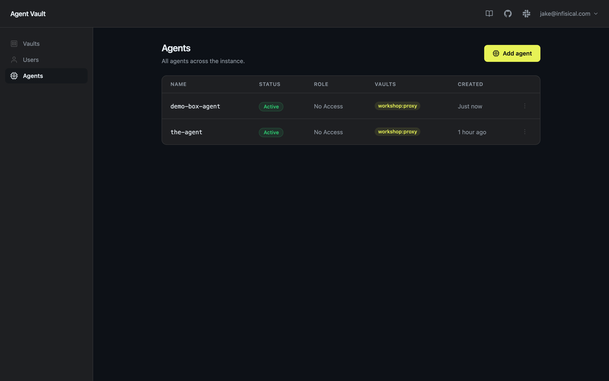

---

# Point a remote agent at the broker

```bash
export AGENT_VAULT_TOKEN=av_agt_...                    # the agent's identity (from Add agent)
export AGENT_VAULT_ADDR=https://broker.internal:14321  # where the broker lives
export AGENT_VAULT_VAULT=workshop                      # which vault to use
agent-vault run -- npm start                           # wraps your process
```

- `agent-vault run` derives `HTTPS_PROXY=http://<token>:<vault>@broker:14322` + CA trust
- Authenticated and vault-scoped, no app code change
- Or bake it in: `ENTRYPOINT ["agent-vault","run","--","npm","start"]`

---

# One broker, many boxes

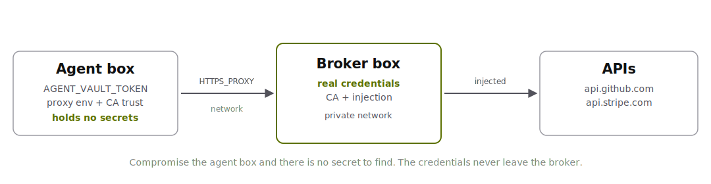

---

# HA considerations

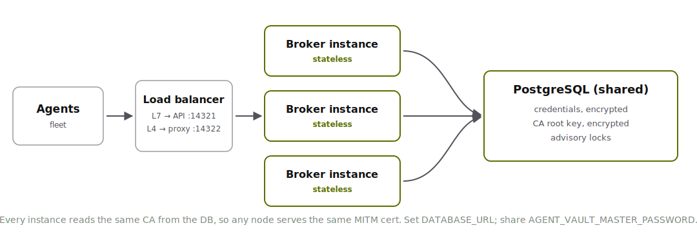

---

<!-- _class: lead -->

# Three takeaways

1. The agent never holds secret zero
2. Egress is enforced, not cooperative
3. Access is requested, approved, audited

## Agents shouldn't see your secrets. With a broker, they can't.

### Questions?

---

<!-- _class: cover -->
<!-- _paginate: false -->

# Thank you

Repo: **github.com/jakehulberg/credential-brokering-workshop**
Docs: Tutorial · Container isolation · Deploy-as-container

Questions?

